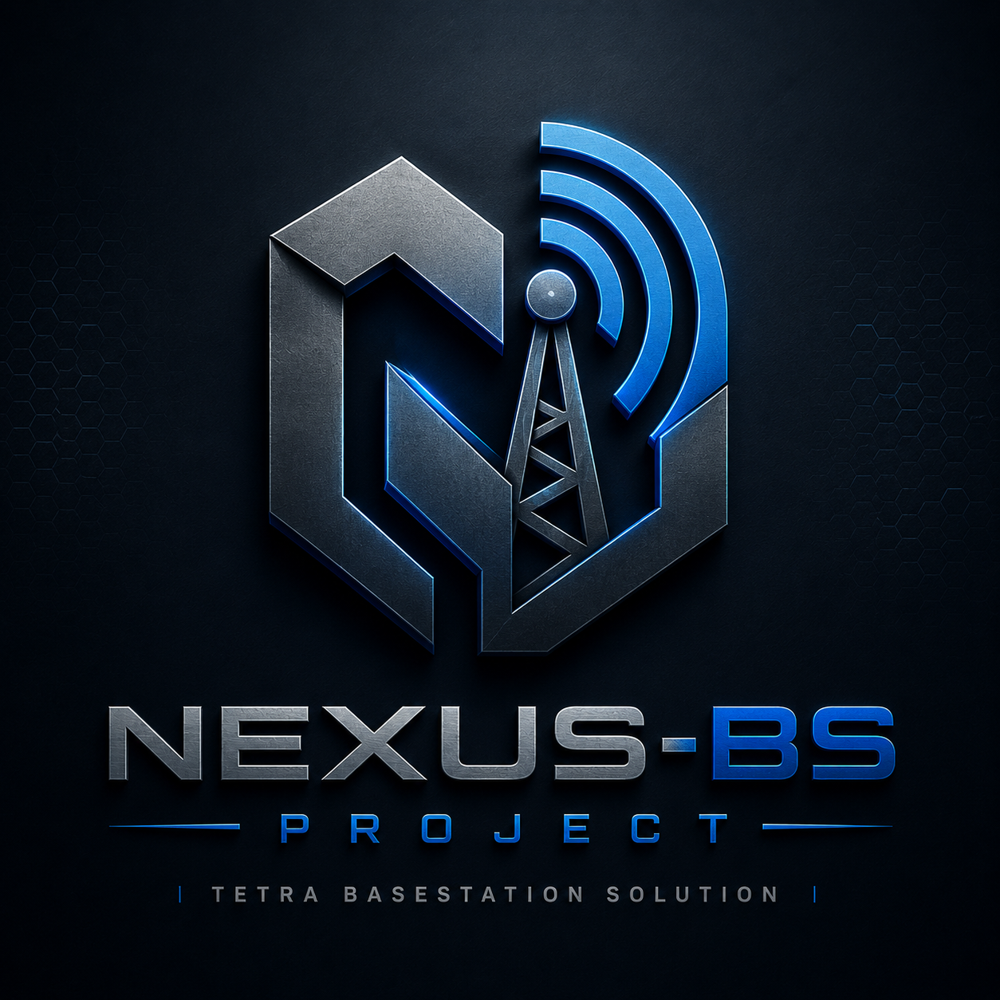

<!--
SPDX-FileCopyrightText: 2026 Chris YO3TCO / Nexus-BS Project
SPDX-License-Identifier: PolyForm-Noncommercial-1.0.0
SPDX-FileComment: See CHANGES-NEXUS.md for the central Nexus-BS change notice.
-->

<p align="center">
  
</p>

# Nexus-BS

Nexus-BS is a source-available TETRA base-station project focused on practical
HAM-radio, lab, and research operation with real SDR hardware and real TETRA
terminals.

The project prioritizes stable core behavior over visual polish or feature
count. Its goal is a solid, auditable starting point for the services an
amateur TETRA operator actually needs: voice, SDS/data signalling, tested
group operation, private P2P calls, Brew interconnect, monitoring, and
long-running service stability.

Nexus-BS is developed around clause-scoped engineering alignment with ETSI
TETRA standards, primarily EN 300 392-2. It does not claim formal ETSI/TETRA
certification. Formal certification requires official conformance evidence.

## Quick Links

| Need | Start here |
|---|---|
| Easy install `.deb` | [Easy Install (.deb)](https://github.com/invictus737/nexus-bs/wiki/Install-from-APT) |
| Build and install from source | [Build From Source](https://github.com/invictus737/nexus-bs/wiki/Build-from-Source) |
| Configure a station | [`example_config/config.toml`](example_config/config.toml) |
| Use systemd services | [`contrib/systemd/`](contrib/systemd/) |
| Review standards workflow/cache | [`Docs/tetra-standards/`](Docs/tetra-standards/) |
| Inspect dashboard assets | [`dashboard/`](dashboard/) |

## Status

| Area | Current project status |
|---|---|
| Local group calls | Implemented and field-tested in local lab/operator configurations |
| Private P2P simplex | Implemented and field-tested |
| Private P2P duplex | Implemented and field-tested where supported by terminal/configuration |
| SDS / status / HMD | Implemented for tested local and Brew-routed paths; not a claim of complete SDS-TL/SNDCP packet-data coverage |
| Brew v1 interconnect | Implemented and tested with multiple TETRA core setups |
| Dashboard | Minimal operational dashboard with telemetry, logs, call/radio state and controls |
| Service supervision / recovery guards | Implemented as bounded queues, fallback config handling, health snapshots, and systemd readiness/watchdog integration |
| WAP over SDS Type4 | Legacy/manual SDS control path, separate from the terminal browser WAP/IP bearer |
| SNDCP / WAP-IP status dashboard | Opt-in WSP/WTP over UDP/IP on SNDCP packet data; default off, advertised only when `[cell_info.wap_ip] enabled=true` |
| TEA/AIE authentication/encryption | Not implemented as a complete service offering |
| Formal TETRA certification | Not claimed |

Feature behavior can vary by terminal model, firmware, codeplug, RF setup,
frequency plan, SDR driver, and network configuration. Treat the current release
as engineering work made available for audit, testing, and improvement.

## Field-Tested Terminals

Nexus-BS has been tested in the project operator/lab environment with Motorola
and Hytera TETRA terminals across older and current firmware generations,
including Motorola firmware releases from MR5.10-era devices through MR2026.1.

Documented field-test equipment includes:

| Vendor | Terminals |
|---|---|
| Motorola | MTP850, MTH800, MTM800E, MTM5400, MXP600 |
| Hytera | PT580H Plus |

Maintainer field tests have covered core local operation, group calls, P2P
simplex, P2P duplex, SDS/status paths, and interconnect behavior. This is not a
universal compatibility guarantee for every firmware, codeplug, terminal
variant, RF setup, or network configuration. Motorola and Hytera are named only
to identify tested hardware; Nexus-BS is not affiliated with, sponsored by, or
endorsed by those vendors.

## What Changed Compared with the Baseline

Nexus-BS started from the BlueStation/FlowStation lineage, but the cited
engineering delta is not a cosmetic rename comparison. The project has
significant rewrites, hardening, new state machines, new TETRA primitives,
dashboard/control integration, and a much larger test surface.

The internal delta report compares Nexus-BS `v0.1.61-1-g4ab64b2`
(commit `4ab64b2`) against FlowStation `v0.2.7` (commit `c2f0ee6`) using
function-level Rust source metrics. These numbers are code-history metrics for
that comparison point. They are not proof of complete semantic coverage,
current-release coverage, or formal conformance.

From the FlowStation v0.2.7 comparison:

| Scope | FlowStation | Nexus-BS | Modified | Added | Removed |
|---|---:|---:|---:|---:|---:|
| All `tetra-*` production functions | 1,867 | 3,303 | 516 | 1,444 | 8 |
| TETRA protocol-core production functions | 1,596 | 2,853 | 436 | 1,265 | 8 |
| Test functions | 50 | 1,168 | 19 | 1,122 | 4 |

Largest areas of change recorded in the report:

| Component area | Modified | Added |
|---|---:|---:|
| UMAC/MAC scheduler | 66 | 269 |
| CMCE call control | 84 | 171 |
| CMCE/SDS PDUs | 41 | 234 |
| UMAC/MAC PDUs | 32 | 114 |
| MM attach / energy economy / affiliation | 28 | 106 |
| MM PDUs / IEs | 35 | 97 |
| LLC timers / ACKs | 14 | 79 |
| Brew/IP gateway | 30 | 44 |
| SDS service | 16 | 32 |
| MLE broadcast / network time | 22 | 23 |
| MLE PDUs | 20 | 31 |
| LMAC / burst codec | 18 | 8 |
| PHY / RF IO | 16 | 8 |
| SNDCP / WAP-IP primitives | 1 | 4 |
| Parrot private-call service | 0 | 15 |

The public release may omit internal history files while still carrying the
current source snapshot.

## TETRA Core Focus

Nexus-BS concentrates on base-station core behavior before optional or cosmetic
features.

Main engineering areas:

- **UMAC/MAC scheduling:** resource grants, random access handling, STCH/TCH/S
  scheduling, fragmentation, burst timing, listener scheduling and traffic slot
  management.
- **CMCE call control:** local and routed group calls, private individual calls,
  setup/connect/release flows, floor grants, floor release, hangtime, timers,
  clear-down behavior and compatibility guards for older terminals.
- **MM registration and affiliation:** attach/update handling, group identity
  affiliation, restart recovery, local SSI/GSSI policy and energy economy
  negotiation/assignment.
- **LLC behavior:** ACK/retransmission timing, duplicate guards, downlink
  signalling-frame timing and robustness around delivery reports.
- **SDS/status:** tested local ISSI/GSSI SDS paths, Brew-forwarded SDS,
  delivery-report handling, U-STATUS/D-STATUS work, Home Mode Display,
  supplemental SDS broadcast and dashboard-triggered SDS.
- **SNDCP/WAP-IP status service:** source-available SN-SAP, PDP context,
  SN-UNITDATA, IPv4/UDP, WSP/WTP over UDP/IP, WAP 2.0/WML2 XHTML-MP status page
  and LTPD/MLE runtime wiring for an opt-in terminal WAP browser status page.
  TCP/HTTP is a compatibility/debug path; the terminal browser profile should
  use the WSP/WTP UDP gateway on port 9200. The default remains off; SNDCP is
  advertised only when `[cell_info.wap_ip] enabled=true`, and terminal auto-open
  depends on the terminal WAP homepage/profile configuration.
- **MLE broadcast:** network broadcast, network time and cell/system
  information.
- **LMAC/PHY/RF integration:** burst codec work, SoapySDR timing, RF IO,
  calibration support and field-oriented SDR operation.
- **Brew/IP gateway:** Brew v1 framing, group/private interconnect, SDS,
  heartbeat/reconnect behavior, RSSI reporting and dashboard state.

## ETSI Standards Position

Protocol changes are developed against local ETSI standards text and targeted
tests. The project uses EN 300 392-2 clause-scoped reasoning for CMCE, MM, LLC,
MLE, UMAC/MAC, SDS/status and energy economy behavior.

Important wording:

- Nexus-BS aims for standards-aligned engineering behavior.
- Nexus-BS includes tests and field checks for many TETRA primitives.
- Nexus-BS does not claim formal ETSI/TETRA certification.
- Nexus-BS does not claim complete coverage of every TETRA service, optional
  feature, terminal vendor behavior or conformance-test scenario.

The `Docs/tetra-standards/` folder contains the standards workflow and local
text cache used by this project for repeatable review.

## Brew / TetraPack / SmartConnect

Nexus-BS implements Brew v1 interconnect using WebSocket transport and Brew
framing. In tested configurations, Brew functionality has been confirmed through
multiple TETRA core setups.

Covered areas include:

- subscriber registration and group affiliation propagation;
- group call start/end and voice frame routing;
- private circuit-call setup/connect/release;
- private simplex floor granted/idle handling;
- SDS transfer and delivery reports;
- heartbeat/reconnect behavior;
- RSSI and operational status reporting to the dashboard.

P2P simplex and duplex paths have also been verified through TetraPack
SmartConnect in tested configurations.

Nexus-BS is not affiliated with, sponsored by, or endorsed by BrandMeister,
TetraPack, SmartConnect, Motorola, Hytera, or any third-party core
operator/vendor. Use requires valid credentials and operator permission for the
network being used.

## Dashboard and Operations

The dashboard is intentionally operational and minimal. It exists to support
monitoring, diagnosis and service control, not to be a showcase UI.

Nexus-BS runs a few background parts for reliability, but normal operation uses
one helper command:

```sh
nexus-bs-service start
nexus-bs-service status
nexus-bs-service logs
nexus-bs-service restart
```

Dashboard and telemetry coverage includes:

- registered radios, ISSIs, groups, RSSI and energy-saving state;
- active calls and last-heard voice/SDS activity;
- Brew link state and traffic status;
- logs with filtering;
- RF/system information;
- config profile management;
- live SDS broadcast queue;
- service control hooks;
- health snapshots and core-stall monitoring.

Operational hardening includes fallback config loading, bounded queues, bounded
HTTP/body handling, slow-client handling, persistent config editing, volatile
runtime cache support, health snapshots, and systemd readiness/watchdog
integration. These are engineering recovery guards, not a guarantee of
uninterrupted service.

The long-term target is 24x7 operation, nonstop use, high redundancy and high
availability for voice, data/SDS and control services. Stability and core
completeness are preferred over decorative features.

## Tests and Evidence

The delta report records 1,168 test functions under `crates/tetra-*` test scope
for Nexus-BS, compared with 50 for FlowStation v0.2.7 at the cited comparison
point. That is engineering regression evidence, not formal conformance
evidence.

The test tree exercises areas including TETRA entities, PDUs, configuration
parsing, dashboard contracts, control paths, CMCE group/private call behavior,
SDS/status routing, MM registration/affiliation/restart recovery, UMAC
scheduling, LLC ACK/retransmission behavior, bounded queues, and parser guards.

## Installation

There are two beginner install methods:

| Method | Use this when |
|---|---|
| [Easy Install (.deb)](https://github.com/invictus737/nexus-bs/wiki/Install-from-APT) | You want the prebuilt `arm64` release package from GitHub Releases. |
| [Build From Source](https://github.com/invictus737/nexus-bs/wiki/Build-from-Source) | You want to compile Nexus-BS yourself or your target is not `arm64`. |

Easy install:

```sh
dpkg --print-architecture
```

If it prints `arm64`, use [Easy Install (.deb)](https://github.com/invictus737/nexus-bs/wiki/Install-from-APT).

Both methods end with the same commands:

```sh
nexus-bs-service edit-config
nexus-bs-service start
```

The live config path is:

```text
/etc/nexus-bs/config.toml
```

Before transmitting, edit only the settings you know: legal TX/RX frequencies,
SDR device, antenna/gains, MCC/MNC, local groups, dashboard password, and
Brew/TetraPack credentials if you have them.

Behind the scenes, the helper manages the RF/TETRA core, dashboard front-end and
local control bridge as separate supervised services.

## Licensing

Nexus-BS is a **mixed-license, source-available** project.

The short version:

- Upstream Apache-2.0 portions remain Apache-2.0.
- Nexus-BS modifications and additions are PolyForm Noncommercial License
  1.0.0 unless file-level notices state otherwise.
- Files that contain both upstream material and Nexus-BS modifications should be
  read with their file-level SPDX notices, `LICENSE-OVERVIEW.md`,
  `CHANGES-NEXUS.md`, and `NOTICE`.
- Commercial licensing applies only to Nexus-BS-covered material, and only to
  the extent permitted by upstream licenses. It does not relicense upstream
  Apache-2.0 portions.

Commercial use of Nexus-BS-covered material requires a separate written
agreement before that use begins.

Repository access, source publication, binary access, forks, issues, pull
requests or public discussion do not grant a commercial license.

See:

- [`LICENSE`](LICENSE)
- [`LICENSE-OVERVIEW.md`](LICENSE-OVERVIEW.md)
- [`CHANGES-NEXUS.md`](CHANGES-NEXUS.md)
- [`COMMERCIAL-LICENSE.md`](COMMERCIAL-LICENSE.md)
- [`NOTICE`](NOTICE)
- [`LICENSES/Apache-2.0.txt`](LICENSES/Apache-2.0.txt)
- [`LICENSES/PolyForm-Noncommercial-1.0.0.txt`](LICENSES/PolyForm-Noncommercial-1.0.0.txt)

Upstream portions remain subject to their applicable upstream license notices
and attribution requirements. Nothing in the Nexus-BS licensing text removes or
narrows rights granted directly by upstream copyright holders under their
original licenses.

Redistribution of Nexus-BS or derivative works must preserve the `Required
Notice:` line in `NOTICE`, the PolyForm Noncommercial terms for Nexus-BS-covered
work, and all applicable upstream license notices. Public use, publication, or
derived work should credit the original upstream authors and Chris YO3TCO /
Nexus-BS Project for the Nexus-BS additions, integration, packaging, dashboard
work, standards-alignment work, and current project form.

This README is not legal advice.

## Credits

Nexus-BS exists because of earlier public TETRA research, upstream projects,
forks, field testing and community work.

Credits and thanks include:

- [BlueStation Project](https://github.com/MidnightBlueLabs/tetra-bluestation)
  for the historical TETRA BS foundation and protocol structure.
- [FlowStation Project](https://github.com/razvanzeces/flowstation) for
  historical field-feature, dashboard, integration and deployment-hardening
  lineage.
- Mihajlo YU4MSH and the
  [misadeks/tetra-bluestation fork](https://github.com/misadeks/tetra-bluestation)
  for contributions relevant to FDX P2P direction and field behavior.
- Harald Welte and the osmocom team for foundational osmocom-tetra work.
- Tatu Peltola for his [SXCEIVER](https://sxceiver.com/) project.
- Stichting NLnet for partial funding through the RETETRA3 grant.
- Dennis DB2OE for dashboard-theme inspiration.
- All historical testing, documentation, hardware, dashboard, integration and
  operator-community contributors, including ON6RF, EA7KEN, BU2GQ, DK5RTA,
  DO5MF, ES4TIX and others.

This release is offered back to the community as a practical starting point for
HAM TETRA operators who want a more complete and stable base for voice, SDS and
interconnect experimentation. Bugs certainly remain. The code is available so
it can be read, audited, tested, validated and improved.

73,

Chris YO3TCO
